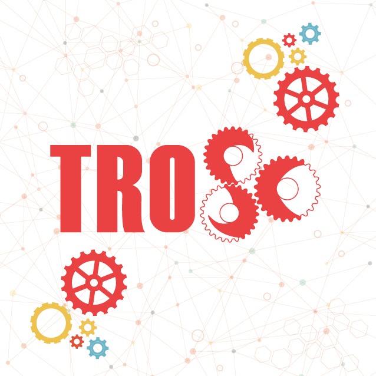

# Trosc-Ramadan-Challenge23

  
  <h1>Ramadan Challenge</h1>

The main idea here is to get hands-on experience trying to use GitHub and learn [how to contribute](https://youtu.be/gnajwrgBNRw) to an opensource project.

Submit 1 PR (Pull Request) per challenge.

## Challenges
- [1-DAY 1 cpp](./Challeges/DAY_01.cpp)     First one solved the bug is Esraa Syam ✨✨
- [2-DAY 2 cpp](./Challeges/DAY_02.cpp)     First one solved the bug is OmarAl-Sayed ✨✨
- [3-DAY 3 cpp](./Challeges/DAY_03.cpp)     First one solved the bug is Ayakhaled0197 ✨✨
- [4-DAY 4 cpp](./Challeges/DAY_04.cpp)     First one solved the bug is NashwaElerian ✨✨
- [5-DAY 5 cpp](./Challeges/DAY_05.cpp)     First one solved the bug is RofydaElghadban ✨✨
- [6-DAY 6 cpp](./Challeges/DAY_06.cpp)     First one solved the bug is O-Abdelaziz ✨✨
- [7-DAY 7 python](./Challeges/DAY_07.py)   First one solved the bug is O-Abdelaziz ✨✨
- [8-DAY 8 cpp](./Challeges/DAY_08.cpp)     First one solved the bug is O-Abdelaziz ✨✨
- [9-DAY 9 cpp](./Challeges/DAY_09.cpp)     First one solved the bug is O-Abdelaziz ✨✨
- [10-DAY 10 cpp](./Challeges/DAY_10.cpp)   First one solved the bug is O-Abdelaziz ✨✨
- [11-DAY 11 cpp](./Challeges/DAY_11.cpp)   First one solved the bug is RofydaElghadban ✨✨
- [12-DAY 12 cpp](./Challeges/DAY_12.cpp)   First one solved the bug is RofydaElghadban ✨✨
- [13-DAY 13 cpp](./Challeges/DAY_13.cpp)   First one solved the bug is O-Abdelaziz ✨✨
- [14-DAY 14 cpp](./Challeges/DAY_14.cpp)   First one solved the bug is RofydaElghadban ✨✨
- [15-DAY 15 cpp](./Challeges/DAY_15.cpp)   First one solved the bug is AbdElaaal ✨✨
- [16-DAY 16 cpp](./Challeges/DAY_16.cpp)   First one solved the bug is Mazen-Ghanaym ✨✨
- [17-DAY 17 cpp](./Challeges/DAY_17.cpp)   First one solved the bug is RofydaElghadban ✨✨
- [18-DAY 18 cpp](./Challeges/DAY_18.cpp)   First one solved the bug is AbdElaaal ✨✨
- [19-DAY 19 cpp](./Challeges/DAY_19.cpp)   First one solved the bug is RofydaElghadban ✨✨
- [20-DAY 20 cpp](./Challeges/DAY_20.cpp)
- [21-DAY 21 cpp](./Challeges/DAY_21.cpp)
- [22-DAY 22 cpp](./Challeges/DAY_22.cpp)
- [more to come](../../issues)...

---
If you are the first one to solve a challenge. Your name will be added next to it.
